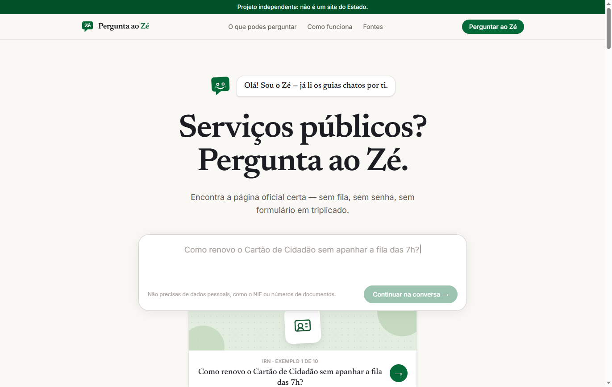

# Pergunta ao Zé

[](https://perguntaaoze.vercel.app)
[](LICENSE)
[](https://nextjs.org)

Os serviços públicos portugueses, numa só pergunta. O **Zé** responde com base
em páginas oficiais e diz-te por onde começar — telefones, horários e links
verificados incluídos.

O visual é a burocracia como objeto físico — senhas de atendimento, carimbos,
formulários e um painel LED de chamada. O Zé é o funcionário do balcão, em
SVG inline, com expressões para cada estado do chat.

Projeto independente — não é um site do Estado.



## Live

**https://perguntaaoze.vercel.app**

## Stack

- Next.js 15 (App Router) + TypeScript + Tailwind CSS v4
- Deploy na Vercel (auto-deploy a cada push em `main`)

## Desenvolvimento

```bash
npm install
npm run dev        # http://localhost:3000
npm run build
```

## Como funciona o motor de respostas

`lib/engine.ts` expõe a interface `AnswerEngine`. Dois motores:

- **KeywordEngine** (defeito): respostas curadas com matching por palavras e
  radicais sobre a base de conhecimento em `lib/data/temas.ts`. Grátis e
  instantâneo — é também o último nível de reserva.
- **LlmEngine**: provider OpenAI-compatible (em produção: Groq com
  `openai/gpt-oss-120b`). Só responde com base nos temas curados e só cita
  as fontes fornecidas. Cadeia de resiliência:
  `LLM_MODEL` → `LLM_MODEL_FALLBACK` → KeywordEngine.

Ativar o LLM — ver `.env.example`:

```bash
ANSWER_ENGINE=llm
LLM_BASE_URL=https://api.groq.com/openai/v1
LLM_API_KEY=...
LLM_MODEL=openai/gpt-oss-120b
LLM_MODEL_FALLBACK=openai/gpt-oss-20b   # opcional
```

### Chat bilingue (PT | EN)

O chat deteta a língua da pergunta (heurística → última língua → navegador)
e há um seletor PT|EN que fixa a escolha. Em inglês, o Zé serve traduções
curadas de `lib/data/temas.en.ts` — ficheiro **gerado e commitado** por
`npm run traduzir:en` (não é gerado em runtime nem a cada build). O script
só re-traduz respostas cujo texto PT mudou (hash por entrada) e falha se a
tradução alterar números, valores em € ou URLs. Respostas marcadas
`revisao: true` não são servidas até revisão humana — nesse caso, e quando
falta tradução, o chat responde em PT com uma nota em inglês.

### Rate limit em produção

A rota `/api/responder` limita 20 pedidos/10 min por IP (hash com sal) e
`MAX_LLM_CALLS_PER_DAY` chamadas ao LLM por dia UTC. Por defeito corre **em
memória** — em serverless cada instância conta por si, pelo que o limite
real é ~limite × instâncias quentes. Para proteção real da quota:

1. Cria uma base Redis grátis em [console.upstash.com](https://console.upstash.com)
   (ou um store **Vercel KV** no dashboard do projeto).
2. Na Vercel → Settings → Environment Variables, copia:
   - Upstash: `UPSTASH_REDIS_REST_URL` e `UPSTASH_REDIS_REST_TOKEN`
   - Vercel KV: `KV_REST_API_URL` e `KV_REST_API_TOKEN` (já injetadas se
     ligares o store ao projeto)
3. Define também `RATE_LIMIT_SALT` com um valor aleatório longo — em
   produção o arranque **falha** sem ele (em dev usa um defeito inseguro).

Se as envs existirem, o site usa Redis automaticamente; sem elas (ou se o
Redis estiver em baixo) cai no limitador em memória, com aviso no log.
Exceção: o teto diário do LLM falha *fechado* — se o contador não responder,
o site responde só com o KeywordEngine. Confirma nos logs de arranque:
com Redis não há aviso; sem ele aparece `[ratelimit] Sem UPSTASH_REDIS_…`.

## Estrutura

```
app/                  páginas (/, /chat, /fontes, /privacidade, /termos)
app/api/responder/    POST { pergunta } -> resposta do motor
app/opengraph-image   cartão de partilha gerado automaticamente
components/           Header, Footer, Chat, ZePersonagem, SenhaTema,
                      FontesArquivo (arquivo expansível de /fontes)...
lib/data/temas.ts     base de conhecimento curada (temas, perguntas, fontes)
lib/data/temas.en.ts  traduções EN geradas (scripts/gerar-temas-en.mjs)
lib/data/fontes.ts    entidades oficiais + contactos (telefone, horário, email)
lib/engine.ts         motores de resposta (keyword + LLM com fallback)
lib/i18n.ts           deteção de língua da pergunta (heurística)
```

## Contribuir

Sugestões e correções são bem-vindas — especialmente novos temas:

1. Abre um issue com o template **"Sugerir um tema ou pergunta"** (ou
   **"Reportar erro"** se encontrares um link ou contacto desatualizado).
2. Para contribuir com código, edita `lib/data/temas.ts`: cada tema tem
   perguntas com `palavras` (keywords normalizadas, sem acentos) e uma
   resposta com passos + fontes oficiais.
3. Regra de ouro: **toda a informação e contactos têm de estar confirmados
   numa página oficial** — links testados, sem inventar.

A página `/fontes` e as estatísticas da homepage atualizam-se
automaticamente a partir da base.

## Licença

[MIT](LICENSE) — o conteúdo curado aponta para fontes oficiais, que
pertenecem às respetivas entidades.
